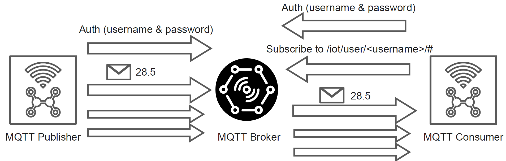

# Python MQTT Playground

This Project contains a group of Python MQTT Paho examples focusing on the following aspects:

- Simple MQTT Producer and Consumer
- MQTT Producer and Consumer with Authentication
- Json MQTT Producer and Consumer
- IoT Device Demo Producer and Consumer

Reference MQTT Python Library Paho - https://github.com/eclipse/paho.mqtt.python

## Paho Installation

```bash
pip install paho-mqtt==1.6.1
```

A new version of the library is available, but for this playground we use the 1.6.1 that is stable and works fine.

---

## Playground Outline

- [Simple Producer & Consumer](#1-simple-producer--consumer)
- [JSON Producer & Consumer](#2-json-producer--consumer)
- [Device Producer & Consumer](#3-device-producer--consumer)
- [Authorized Producer & Consumer](#4-authorized-producer--consumer)
- [MQTT IoT Smart Object](#5-mqtt-iot-smart-object)

### 1. Simple Producer & Consumer


 
In this exercise, we configure an MQTT Producer to simulate data generated by a temperature sensor and 
a Consumer to receive and process that data in real time.

The Producer will establish a connection to an MQTT Broker, which serves as the central hub for message exchange.
Once connected, the Producer publishes a series of n messages (e.g., 1000) containing only numeric temperature values. 
These messages are sent to the sensor/temperature topic.
For this setup, messages will be published with Quality of Service (QoS) level set to 0, 
meaning no delivery guarantee beyond a best-effort attempt. Additionally, the Retained flag is set to false, indicating that the Broker should not store these messages once sent.

The Consumer, acting as a receiver, also connects to the MQTT Broker.
It subscribes to the # topic, a wildcard subscription that enables it to receive all published messages across topics.
As messages are received, the Consumer reads the numeric temperature values and displays them, allowing to observe the real-time data flow.

- **Python Files**:
  - `process/simple_producer.py`
  - `process/simple_consumer.py`

- **Producer**:
  - Connect to the MQTT Broker.
  - Publish `n` messages (e.g., 1000) with simple numeric values to `sensor/temperature` topic.
  - Message properties: `QoS = 0`, `Retained = false`.

- **Consumer**:
  - Connect to the MQTT Broker.
  - Subscribe to `#` topic to receive all messages.
  - Read and display the received numeric values.

### 2. JSON Producer & Consumer


In the second exercise, we build on the basics of MQTT by creating a producer and consumer 
that handle structured data in JSON format. This exercise introduces the concept of message serialization and deserialization using JSON, 
as a common format for IoT data exchange.

The Producer establishes a connection to the MQTT Broker, similar to the first exercise.
Once connected, the Producer publishes a series of n messages to the sensor/temperature topic. 
This time, instead of sending simple numeric values, the Producer uses the `MessageDescriptor` class to create structured messages in JSON format. 
Each JSON message contains more organized data associated with the temperature sensor.
The messages are published with a Quality of Service (QoS) level of 0, meaning no guaranteed delivery, and the Retained flag is set to false, instructing the Broker not to retain the messages.

The Consumer also connects to the MQTT Broker and subscribes to the # topic to capture all messages.
Upon receiving each message, the Consumer deserializes the JSON payload back into the MessageDescriptor class format, 
allowing it to process and interpret the structured data effectively.

- **Python Files**:
  - `process/json_producer.py`
  - `process/json_consumer.py`
  - `dto/message_descriptor.py`

- **Producer**:
  - Connect to the MQTT Broker.
  - Publish `n` messages to `sensor/temperature` topic using structured JSON messages with `MessageDescriptor` class.
  - Message properties: `QoS = 0`, `Retained = false`.

- **Consumer**:
  - Connect to the MQTT Broker.
  - Subscribe to `#` topic to receive JSON messages.
  - Deserialize JSON messages using `MessageDescriptor` class.

### 3. Device Producer & Consumer


In this exercise, we implement an MQTT-based system that not only transmits sensor data but also shares device-specific information. 
This exercise introduces device registration and data streaming using multiple MQTT topics.

The Producer connects to the MQTT Broker.
It first publishes device information, such as device ID and other metadata, in JSON format using the `DeviceDescriptor` class. 
This information is published to a specific topic in the format `device/<id>/info`, where `<id>` represents the unique identifier of the device. 
The Retained flag is set to true for this message, meaning that the Broker will store this device information for any new subscribers 
who connect after the initial publication.
In addition to device info, the Producer also publishes sensor data (e.g., temperature readings) as JSON messages to the `device/<id>/sensor/temperature` topic.
These sensor messages are set with a Quality of Service (QoS) level of 0 (best effort) and with the Retained flag set to false.

The `Consumer` connects to the MQTT Broker and subscribes to two topics:

- `device/+/info` to receive the descriptors of all registered devices (with + acting as a wildcard for the device ID).
- `device/+/sensor/#` to receive all sensor data for each registered device (using + for device ID and # to match any sensor-related topics).

As messages are received, the Consumer deserializes them into appropriate classes: DeviceDescriptor for device information and MessageDescriptor 
for sensor data, enabling it to interpret and process the different data types.

- **Python Files**:
  - `process/device_producer.py`
  - `process/device_consumer.py`
  - `dto/device_descriptor.py`
  - `dto/message_descriptor.py`

- **Producer**:
  - Connect to the MQTT Broker.
  - Publish device information in JSON format with `DeviceDescriptor` class to `device/<id>/info` topic, setting `Retained = true`.
  - Publish sensor data as JSON to `device/<id>/sensor/temperature` topic.
  - Sensor message properties: `QoS = 0`, `Retained = false`.

- **Consumer**:
  - Connect to the MQTT Broker.
  - Subscribe to `device/+/info` to receive device descriptors and `device/+/sensor/#` for sensor data.
  - Deserialize messages into `DeviceDescriptor` and `MessageDescriptor` classes as appropriate.

### 4. Authorized Producer & Consumer



In this example, we implement an MQTT system with user authentication, 
securing access to specific data topics. 
This exercise highlights the use of authentication credentials in MQTT, enabling message privacy and user-based data handling.

The Producer connects to the MQTT Broker, providing a username and password for authentication. 
This setup restricts access to the MQTT Broker, ensuring that only authenticated clients can publish or subscribe to topics.
After successfully connecting, the Producer publishes n messages (e.g., 1000) containing temperature values to a user-specific topic, 
`/iot/user/<username>/sensor/temperature`. Here, `<username>` represents the authenticated user's identifier, helping to separate data streams by user.
Each message is published with a Quality of Service (QoS) level of 0 (best effort) and with the Retained flag set to false.

The Consumer connects to the MQTT Broker using the same username and password as the Producer, ensuring it can access only the 
topics associated with this authenticated user.
Once authenticated, the Consumer subscribes to the topic `/iot/user/<username>/#`, which allows it to receive all messages published under this user’s namespace, 
including the temperature data from sensor/temperature. As messages arrive, the Consumer reads and displays the received values, allowing to observe data flow within the confines of a secured, user-specific topic structure.

- **Python Files**:
  - `process/auth_producer.py`
  - `process/auth_consumer.py`

- **Producer**:
  - Connect to the MQTT Broker using username and password.
  - Publish `n` messages to `/iot/user/<username>/sensor/temperature` topic.
  - Message properties: `QoS = 0`, `Retained = false`.
  
- **Consumer**:
  - Connect to the MQTT Broker with the same credentials as the producer.
  - Subscribe to `/iot/user/<username>/#` topic.
  - Read and display received messages.

### 5. MQTT IoT Smart Object


In this subsection outlines the core characteristics of a traditional MQTT-enabled IoT device designed for telemetry and event-based data generation
together with the management of incoming actions. 

**MQTT Smart Object Design**:
- Usually an MQTT Smart Object manages a list of resources, such as various types of sensors (e.g., light, temperature, humidity). Each sensor represents a distinct resource that periodically generates data.
- Telemetry: The Smart Object publishes telemetry data from each sensor at regular intervals, updating subscribers with current readings. Telemetry messages are generally non-retained, as they are time-sensitive data snapshots.
- Event: In addition to telemetry, the Smart Object can generate and publish event messages associated with its operational status. These events, such as alerts or notifications, are retained by the Broker to ensure new consumers can access the latest event data even if they connect after the initial event is published.
- Actions: The Smart Object can also subscribe to specific topics to receive commands or actions from external sources. These incoming messages allow the device to perform tasks or respond to adjustments, enabling bidirectional communication and control within the MQTT ecosystem.

This example encapsulates the typical roles of an MQTT IoT device in the Smart Object file `mqtt_smart_object.py`, from telemetry and event generation to optional actuation capabilities, 
showing how MQTT Smart Objects enable comprehensive and interactive IoT applications.
To emulate an external controller for the device the file `mqtt_smart_object_controller.py` is provided, which can send commands to the Smart Object and receive its telemetry and event data.

- **Python Files**:
  - `process/`:
    - `mqtt_smart_object.py`: MQTT Smart Object implementation.
    - `mqtt_smart_object_controller.py`: Smart Object Controller for sending commands and receiving data.
  - `dto/`:
    - `device_descriptor.py`: Device Descriptor class for device information.
    - `message_descriptor.py`: Message Descriptor class for telemetry and event data.
    - `event_descriptor.py`: Event Descriptor class for event data.
    - `action_descriptor.py`: Action Descriptor class for incoming actions.

- **MQTT Smart Object**:
  - Connect to the MQTT Broker.
  - Publish device information `/device/<device_id>/info` topic, setting `Retained = true`.
  - Publish telemetry data from available sensors on the topic `/device/<device_id>/telemetry/<sensor_id>`
    - Telemetry messages include also both sensors and variations on the actuator status (e.g., switch ON/OFF).
  - Publish event messages based on device status on the topic `/device/<device_id>/event`
  - Subscribe to action topics to receive incoming commands on topic `/device/<device_id>/action/<action_id>`

- **MQTT Smart Object Controller**:
  - Connect to the MQTT Broker
  - Subscribe to device `info`, `telemetry`, and `event` topics of the Smart Object
  - When the received value (e.g., temperature) is above a certain threshold, send an action command to the Smart Object to switch `OFF` the actuator
  - Start a Timer to send a command to the Smart Object to switch `ON` the actuator after a certain time interval

#### Threads & Timer Information

In this example we use the `threading` library to manage the MQTT Smart Object and Controller in separate threads 
and timer to execute functions at specific intervals. The `threading` library provides a way to run multiple functions concurrently,

In Python, threading allows for the execution of multiple operations concurrently within a program. This can be particularly useful for performing background tasks without interrupting the main program flow. The `Timer` class, part of the threading module, enables scheduling functions to run after a specified interval, making it ideal for delayed or periodic tasks.

Threading is a way to achieve concurrent execution in Python. Each thread runs independently and can perform tasks such as I/O operations, computations, or interacting with the user.

##### Key Concepts

- **Thread**: The smallest unit of a process that can be scheduled and executed.
- **Main Thread**: The default thread where the Python program starts.
- **Subthread**: Additional threads created to perform concurrent tasks.

Here's a simple example to illustrate how threading works in Python:

```python
import threading
import time

def print_numbers():
    for i in range(10):
        print(i)
        time.sleep(1)

# Create a thread
thread = threading.Thread(target=print_numbers)

# Start the thread
thread.start()

# Continue with the main program
print("Thread started!")
```

Explanation:

- Import threading: Import the threading module to work with threads.
- Define Function: Create a function (`print_numbers`) that prints numbers from 0 to 9 with a delay of 1 second.
- Create a Thread: Initialize a thread that targets the `print_numbers` function.
- Start the Thread: Use `thread.start()` to begin execution of the thread.
- Main Program: The main program continues to execute without waiting for the thread to finish.

##### Timer Class

A Timer is a subclass of Thread that allows you to schedule a function to run after a specified interval. 
This is useful for tasks that need to be executed after a delay or at regular intervals.

Here's an example of how to use the Timer class:

```python
import threading

def greet():
    print("Hello, world!")

# Create a timer
timer = threading.Timer(5, greet)

# Start the timer
timer.start()

print("Timer started!")
```

In this example, we'll create a `Timer` that passes parameters to the target function when it executes.

## Code Example

```python
import threading

def greet(name, message):
    print(f"Hello, {name}! {message}")

# Parameters to be passed to the target function
name = "Alice"
message = "Welcome to the Python threading tutorial."

# Create a Timer
timer = threading.Timer(5, greet, args=(name, message))

# Start the Timer
timer.start()

print("Timer started! The greet function will run after 5 seconds with the given parameters.")
```